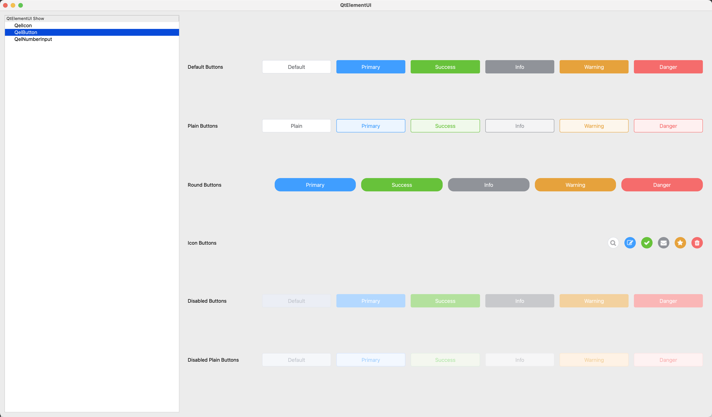
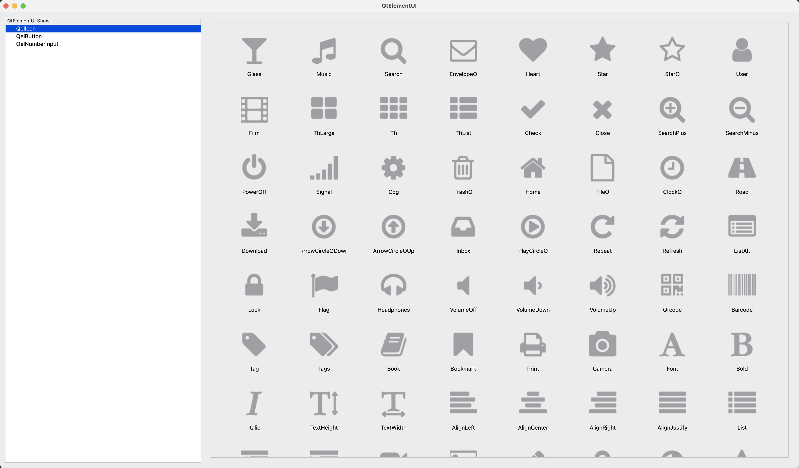
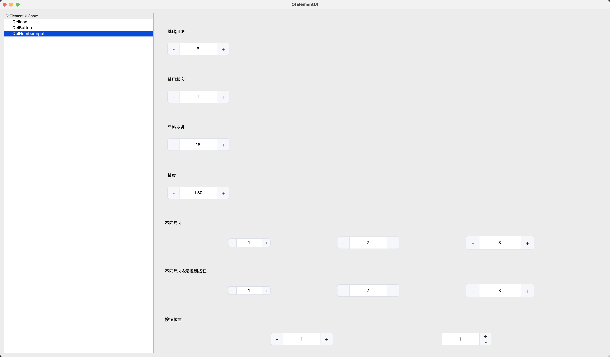

- [QelElementUI 项目](#qelelementui-项目)
  - [安装](#安装)
    - [下载源码](#下载源码)
    - [安装字体](#安装字体)
    - [引入](#引入)
  - [QelShow 项目](#qelshow-项目)
    - [QelShow 功能](#qelshow-功能)
    - [运行 QelShow](#运行-qelshow)
    - [组件展示](#组件展示)
    - [QelIcon 示例](#qelicon-示例)
    - [QelButton 示例](#qelbutton-示例)
    - [QelNumberInput 示例](#qelnumberinput-示例)
    - [QelInput 示例](#qelinput-示例)
    - [QelSelect 示例](#qelselect-示例)
    - [QelCheckbox 示例](#qelcheckbox-示例)
    - [QelRadio 示例](#qelradio-示例)
    - [QelSwitch 示例](#qelswitch-示例)
    - [QelTooltip 示例](#qeltooltip-示例)
  - [自定义](#自定义)

# QelElementUI 项目

QelElementUI 是一个基于 Qt Widgets 的现代化控件库，组件功能、交互语义与视觉规范优先对齐 Element Plus，并使用 Qt-native API 实现对应能力。

## API 对齐基线

QtElementUI 统一以 **Element Plus 当前稳定版本** 作为组件功能、默认值、交互和视觉的参考基线。

- 当前对齐基线：**Element Plus 2.14.6**。
- 每个组件开发/重构时，都应先核对当时最新稳定版的官方 API 与源码，并在 PR 中记录参考版本。
- Web 专属实现不会机械复制到 C++：例如 Popper.js、teleport、virtual DOM 等能力会映射到 `QelPopupManager`、Qt popup/window、QWidget 等 Qt-native 抽象。
- Element UI 2.x 不再作为新组件 API 设计基线；仅在兼容历史行为时作为补充参考。

## 安装

### 下载源码

```bash
git clone git@github.com:CPythoner/QtElementUI.git
```

### 安装字体

由于本组件库使用了 `FontAwesome`  图标字体，需要进行安装，字体文件目录为：`./QelIcon/fonts/fontawesome-4.7.0.ttf`。

### 引入

可以按需引入需要使用的组件，每个组件下面有一个 `.pri` 后缀的文件，将对应组件的 `.pri` 文件引入到 Qt 项目中的 `.pro` 文件即可，例如需要引入 `QelButton` 组件，则在你的 Qt 项目中添加源文件：

```bash
# 在你的 .pro 文件中

include($$PWD/../QelButton/QelButton.pri)
```

## QelShow 项目

`QelShow` 项目是一个专门用于展示 `QelElementUI` 中所有组件的示例项目。它提供了一个直观的用户界面，方便用户查看和测试各个组件的功能和样式。

### QelShow 功能

- 展示所有 `QelElementUI` 组件的使用示例，包括 `QelIcon`、`QelButton`、`QelNumberInput`、`QelInput`、`QelSelect`、`QelCheckbox`、`QelRadio`、`QelSwitch`、`QelForm`、`QelTooltip` 等。

- 通过左侧分类树（如“基础组件”“表单组件”）选择不同组件，右侧展示对应测试界面。

### 运行 QelShow

在 Qt 环境中打开 `QelShow.pro` 项目文件并运行，即可启动展示应用程序。应用程序界面包括左侧的组件树状列表和右侧的展示区域，用户可以通过点击不同组件名称，查看各组件的示例和配置效果。

### 组件展示







### QelIcon 示例

```cpp
#include "QelIcon.h"

QelIcon *icon = new QelIcon(QelIcon::Search, 16, this);
```

### QelButton 示例

```cpp
#include "QelButton.h"

QelButton *button = new QelButton(QelButton::Primary, QelButton::DefaultSize, false, false, false, false, QelButton::Button, QIcon(), "Primary Button", this);
```

### QelNumberInput 示例

```cpp
#include "QelNumberInput.h"

QelNumberInput *numberInput = new QelNumberInput(this);
numberInput->setMinValue(0);
numberInput->setMaxValue(100);
numberInput->setStep(1.0);
numberInput->setSize(QelNumberInput::Default);
```

### QelInput 示例

```cpp
#include "QelInput.h"

QelInput *input = new QelInput(this, QelInput::Type::Text, "请输入内容");
input->setClearable(true);
```

### QelSelect 示例

```cpp
#include "QelSelect.h"

QelSelect *select = new QelSelect(this);
select->addOption("北京", "beijing");
select->addOption("上海", "shanghai");
```

## 自定义

QelElementUI 组件可以通过修改提供的样式表或重写绘制事件进行定制，以满足特定的设计需求。


### QelCheckbox 示例

```cpp
#include "QelCheckbox.h"

qel::QelCheckbox *checkbox = new qel::QelCheckbox(
    "接收通知",      // text
    true,            // checked
    false,           // disabled
    false,           // indeterminate
    true,            // border
    qel::QelCheckbox::Size::Default,
    this
);
```

### QelRadio 示例

```cpp
#include "QelRadio.h"

qel::QelRadio *radio = new qel::QelRadio(
    "选项 A",      // text
    true,          // checked
    false,         // disabled
    true,          // border
    qel::QelRadio::Size::Default,
    qel::QelRadio::StyleType::Default,
    this
);
```

### QelSwitch 示例

```cpp
#include "QelSwitch.h"

qel::QelSwitch *sw = new qel::QelSwitch(this);
sw->setChecked(true);
```


### QelTooltip 示例

```cpp
#include "QelTooltip.h"

QelButton *button = new QelButton(
    QelButton::Default,
    QelButton::DefaultSize,
    false,
    false,
    false,
    false,
    QelButton::Button,
    QIcon(),
    "Hover me",
    this);

qel::QelTooltip *tooltip = new qel::QelTooltip(button, button);
tooltip->setContent("Tooltip content");
tooltip->setPlacement(qel::QelTooltip::Placement::Top);
tooltip->setEffect(qel::QelTooltip::Effect::Dark);
tooltip->setTrigger(qel::QelTooltip::Trigger::Hover);
tooltip->setShowAfter(0);
tooltip->setHideAfter(200);
```

`QelTooltip` follows the Element Plus tooltip behavior model. Qt mappings
cover 12 placements, fallback placements, dark/light effects, raw/custom
content, controlled visibility, disabled state, offset, show-arrow,
arrow-offset, show-after, hide-after, auto-close, hover/focus/click/contextmenu
triggers, trigger keys, focus-on-target, enterable content, persistence,
popper class/style, and screen boundary handling through `QelPopupManager`.

Web-only implementation details such as Popper.js options, GPU acceleration,
teleport targets, and browser positioning strategies are intentionally mapped
to Qt infrastructure instead of being copied as fake C++ APIs.
