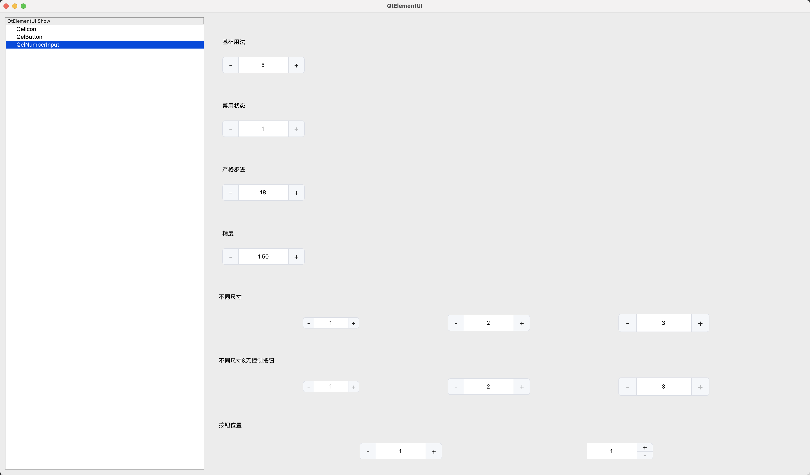

- [QelElementUI 项目](#qelelementui-项目)
  - [安装](#安装)
    - [下载源码](#下载源码)
    - [安装字体](#安装字体)
    - [引入](#引入)
  - [QelShow 项目](#qelshow-项目)
    - [QelShow 功能](#qelshow-功能)
    - [运行 QelShow](#运行-qelshow)
    - [组件展示](#组件展示)
    - [QelIcon 示例](#qelicon-示例)
    - [QelButton 示例](#qelbutton-示例)
    - [QelNumberInput 示例](#qelnumberinput-示例)
  - [自定义](#自定义)

# QelElementUI 项目

QelElementUI 是一个基于 Qt 的自定义控件库，模仿了 Element UI 的部分组件，实现了类似的功能。此项目的主要目标是提供一个在 Qt 环境中使用的现代化 UI 组件集合。

## 安装

### 下载源码

```bash
git clone git@github.com:CPythoner/QtElementUI.git
```

### 安装字体

由于本组件库使用了 `FontAwesome`  图标字体，需要进行安装，字体文件目录为：`./QelIcon/fonts/fontawesome-4.7.0.ttf`。

### 引入

可以按需引入需要使用的组件，每个组件下面有一个 `.pri` 后缀的文件，将对应组件的 `.pri` 文件引入到 Qt 项目中的 `.pro` 文件即可，例如需要引入 `QelButton` 组件，则在你的 Qt 项目中添加源文件：

```bash
# 在你的 .pro 文件中

include($$PWD/../QelButton/QelButton.pri))
```

## QelShow 项目

`QelShow` 项目是一个专门用于展示 `QelElementUI` 中所有组件的示例项目。它提供了一个直观的用户界面，方便用户查看和测试各个组件的功能和样式。

### QelShow 功能

- 展示所有 `QelElementUI` 组件的使用示例，包括 `QelIcon`、`QelButton`、`QelNumberInput` 等。

- 通过左侧的树状列表选择不同的组件，右侧展示对应的测试界面。

### 运行 QelShow

在 Qt 环境中打开 `QelShow.pro` 项目文件并运行，即可启动展示应用程序。应用程序界面包括左侧的组件树状列表和右侧的展示区域，用户可以通过点击不同组件名称，查看各组件的示例和配置效果。

### 组件展示




### QelIcon 示例

```cpp
#include "QelIcon.h"

QelIcon *icon = new QelIcon(QelIcon::Search, 16, this);
```

### QelButton 示例

```cpp
#include "QelButton.h"

QelButton *button = new QelButton(QelButton::Primary, QelButton::Medium, false, false, false, false, QelButton::Button, QIcon(), "Primary Button", this);
```

### QelNumberInput 示例

```cpp
#include "QelNumberInput.h"

QelNumberInput *numberInput = new QelNumberInput(this);
numberInput->setMinValue(0);
numberInput->setMaxValue(100);
numberInput->setStep(1.0);
numberInput->setSize(QelNumberInput::Default);
```

## 自定义

QelElementUI 组件可以通过修改提供的样式表或重写绘制事件进行定制，以满足特定的设计需求。
